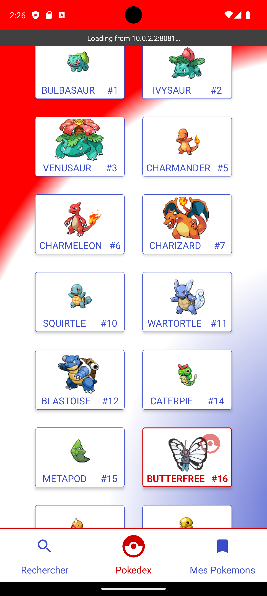

# ECF - REACT NATIVE - MARS 2024

Application Pokédex. Actuellement, seule la consultation de la liste des pokémons, et leur ajout en favoris sont implémentés.
Des fonctionnalités de tri seront implémentés prochainement.

Cette application n'a pas été testée, et ne sera sans doute pas testée sur IOS.

[Enoncé complet](docs/sujet-ecf-20-03-24.md)

## ScreenShots




## Installation
Assurez vous d'avoir préalablement une machine virtuelle Android en cours d'execution.

```shell 
npx react-native run-android
# ou
npm start        # puis a
# ou
npm run android
```

