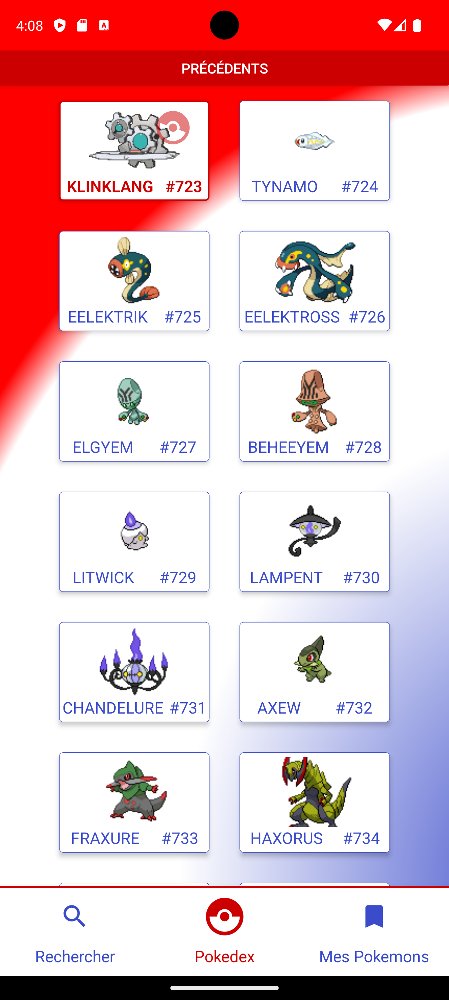
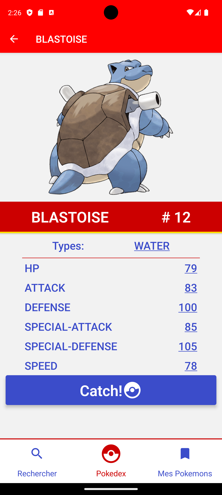

# ECF - REACT NATIVE - MARS 2024
### 20/04/2023 - 21/04/2023

Application Pokédex en React Native 0.73 en consommant l'API [PokéApi](https://pokeapi.co/).  
Cette application permet l'affichage des Pokémons avec pagination, l'affichage de leur détais et l'ajout dans une collection stockée localement.  
Prochainement, l'ajout d'un outil de recherche et de tri sera implémenté, ainsi que la possibilité de consulter les évolutions passées et à venir des pokémons depuis leur page de détails.  

Pour connaître l'avancement des futures fonctionnalités, n'hésitez pas à consulter la branche **[dev](https://github.com/FrancoisDoue/m2i_ecf_mars/tree/dev)** de ce repository.

- **[Screenshots](#screenshots)**
- **[Packages utilisés](#packages)**
- **[Installation](#installation)**
---
### **[Enoncé complet](docs/sujet-ecf-20-03-24.md)**

---

## <a id='screenshots'></a>ScreenShots





## <a id='packages'></a>Packages utilisés
```shell
react-native-screens: "^3.29.0"
react-native-safe-area-context: "^4.9.0"
@react-navigation/native: "^6.1.17"
@react-navigation/native-stack: "^6.9.26"
@react-navigation/native-stack: "^6.9.26"

react-native-vector-icons: "^10.0.3"
react-native-gradients: "^2.1.1"
react-native-svg: "^15.1.0"

react-redux: "^9.1.0"
@reduxjs/toolkit: "^9.1.0"

axios: "^1.6.8"
@react-native-async-storage/async-storag: "^1.23.1"
```

## <a id='installation'></a>Installation
Assurez vous d'avoir préalablement une machine virtuelle Android en cours d'execution.

```shell 
npx react-native run-android
# ou
npm start
# ou
npm run android
```

